# RETO N° 2 : "Identificando los tipos de navegación"
***
## Breve descripción :
Se debe identificar los tipos de naavegación de lo siguientes sites :     
 *  Breather (https://breather.com/?version=c).
 * GitHub(https://github.com)
 * Medium (https://medium.com/ )

 ***

 ## Breather:

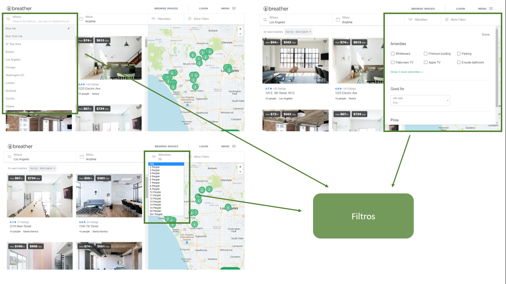
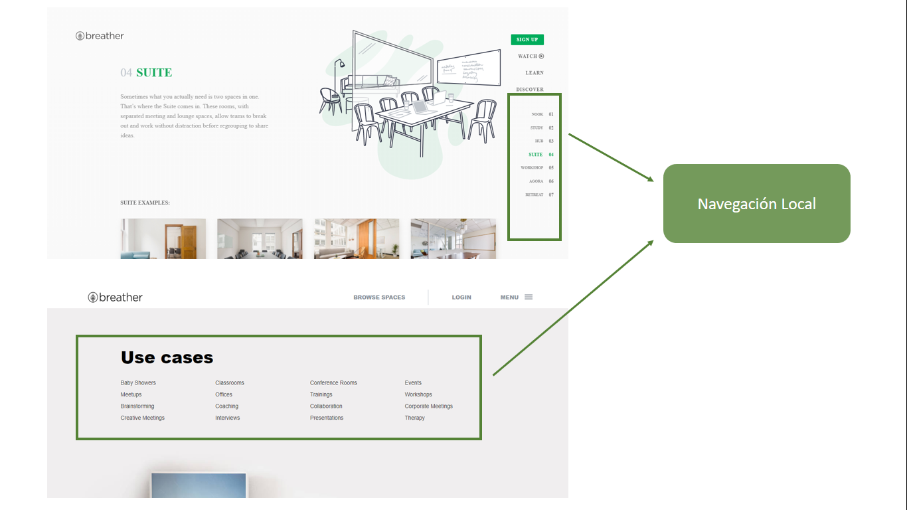

***

## GitHub:
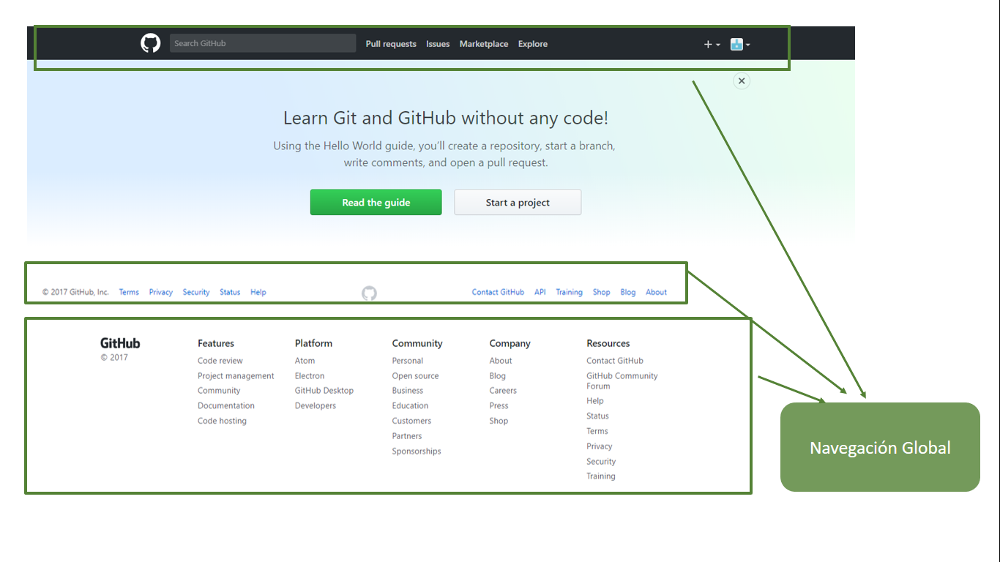
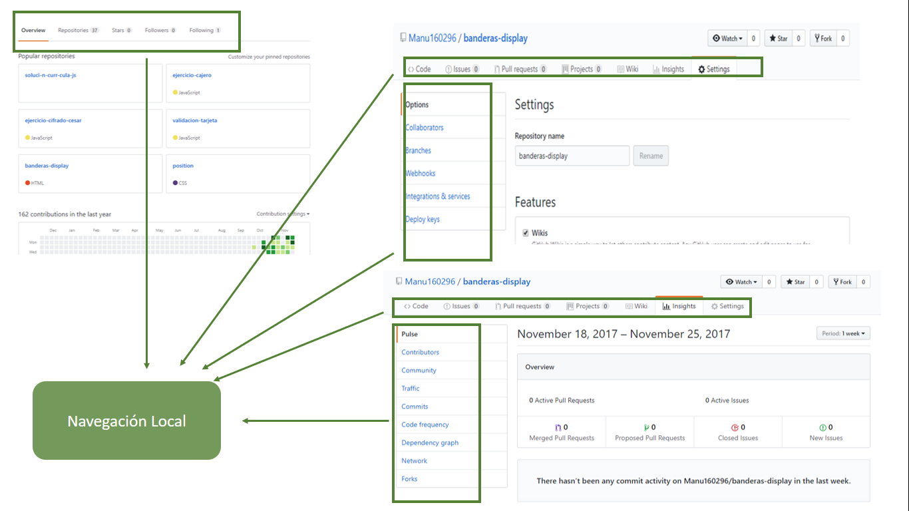
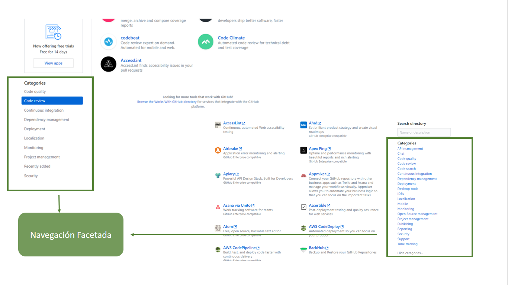
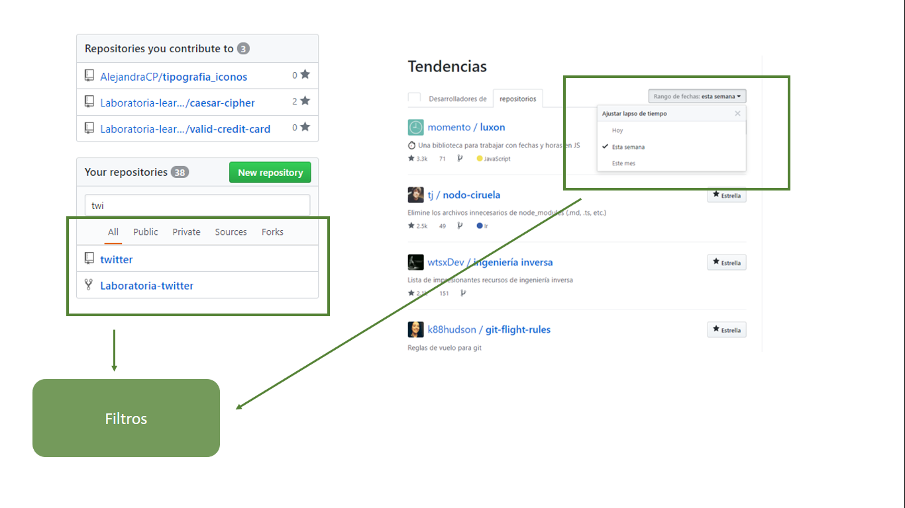
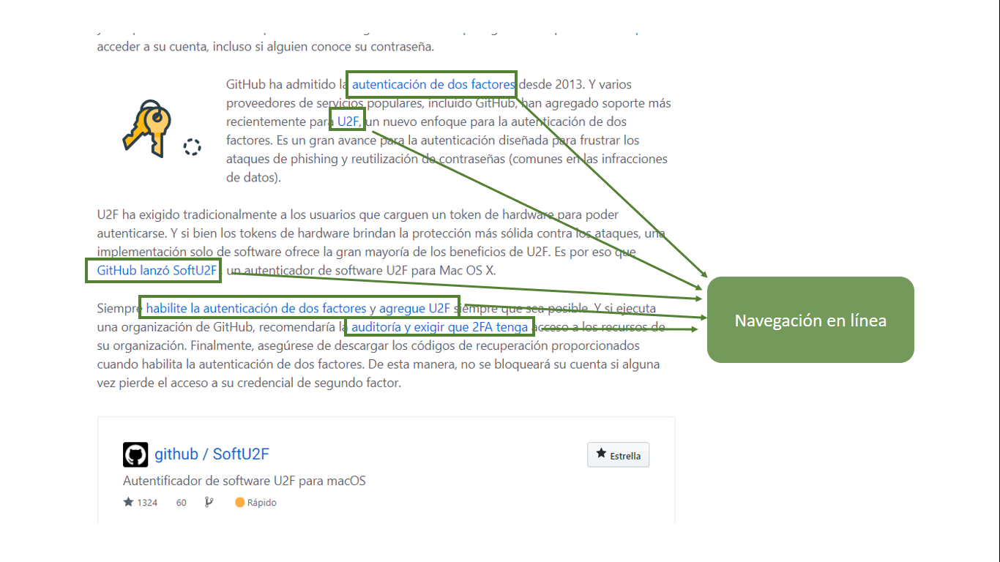
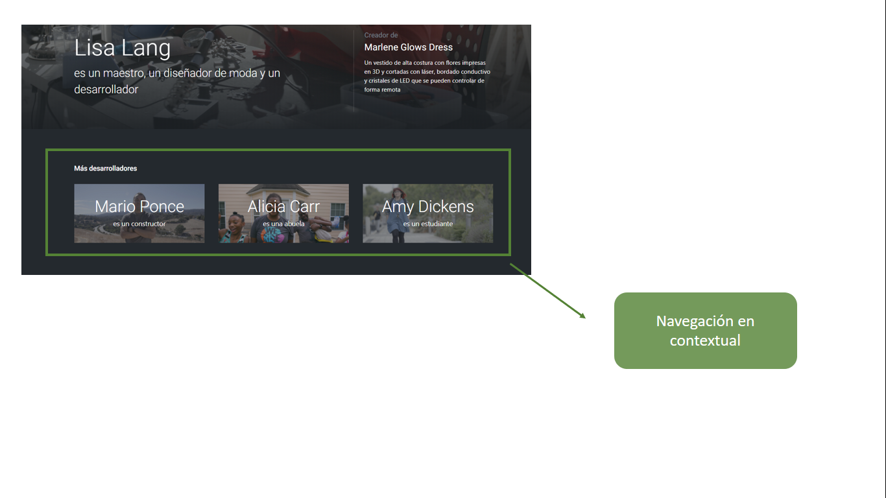

***
## Medium:
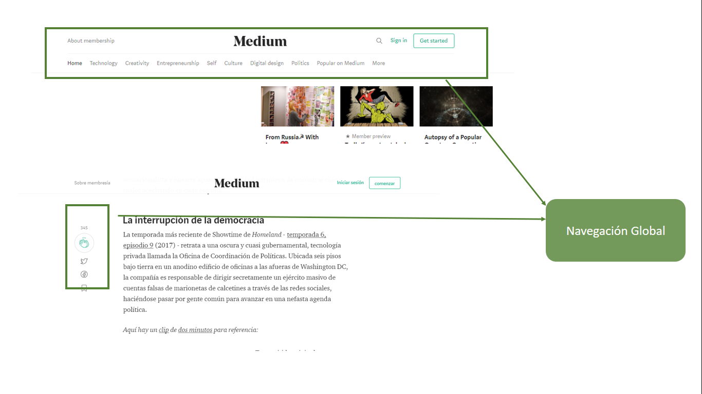
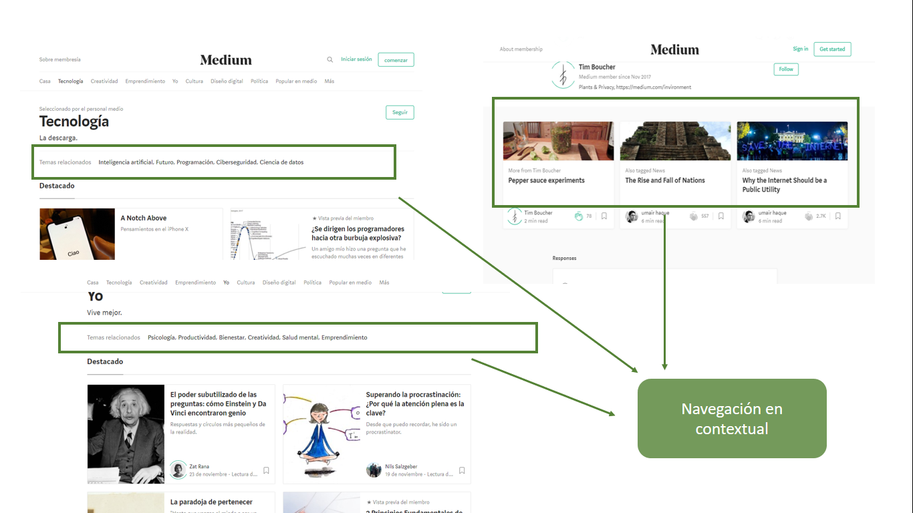
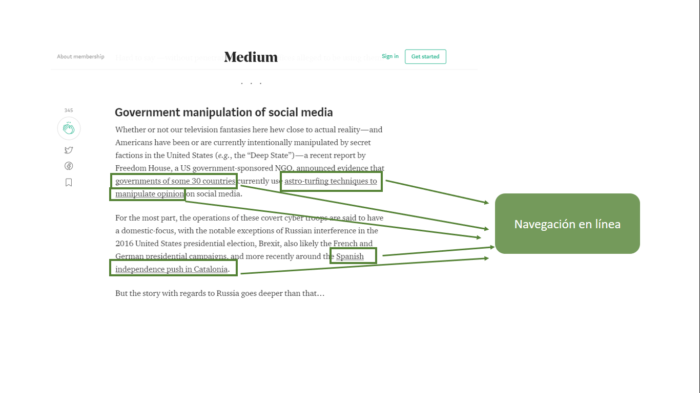
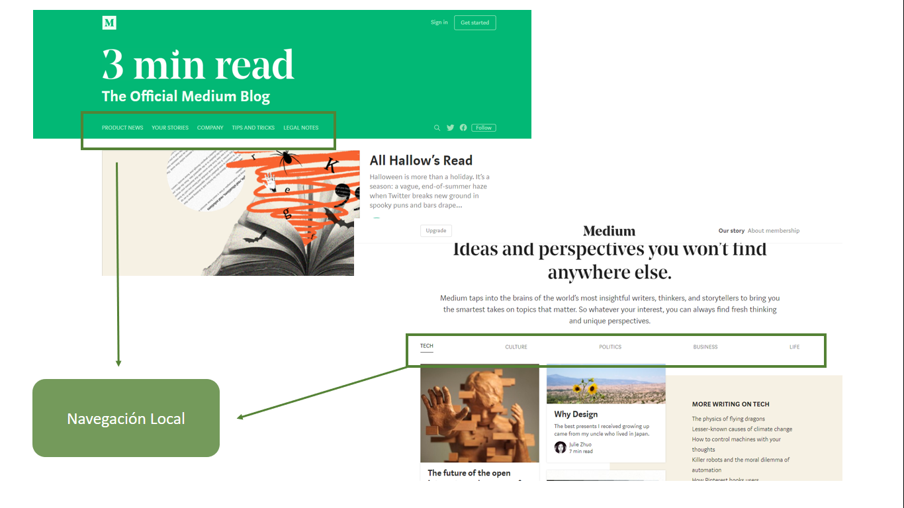
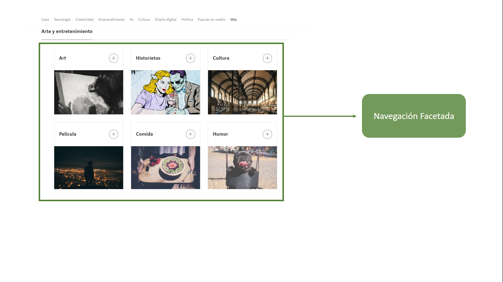
